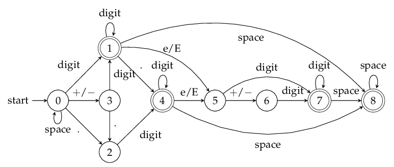

## 题目描述

**有效数字**（按顺序）可以分成以下几个部分：

1. 一个 **小数** 或者 **整数**

2. （可选）一个 `'e'` 或 `'E'` ，后面跟着一个 **整数**：`1.1E10`

**小数**（按顺序）可以分成以下几个部分：

1. （可选）一个符号字符（`'+'` 或 `'-'`）
2. 下述格式之一：
	1. 至少一位数字，后面跟着一个点 `'.'`：`1.`
	2. 至少一位数字，后面跟着一个点 `'.'` ，后面再跟着至少一位数字
	3. 一个点 `'.'` ，后面跟着至少一位数字 `.1`

整数（按顺序）可以分成以下几个部分：

（可选）一个符号字符（'+' 或 '-'）
至少一位数字
部分有效数字列举如下：

```
["2", "0089", "-0.1", "+3.14", "4.", "-.9", "2e10", "-90E3", "3e+7", "+6e-1", "53.5e93", "-123.456e789"]
```

部分无效数字列举如下：

```
["abc", "1a", "1e", "e3", "99e2.5", "--6", "-+3", "95a54e53"]
```

给你一个字符串 `s` ，如果 `s` 是一个 **有效数字** ，请返回 `true` 。

**示例 1：**

```
输入：s = "0"
输出：true
```

**示例 2：**

```
输入：s = "e"
输出：false
```

**示例 3：**

```
输入：s = "."
输出：false
```

**示例 4：**

```
输入：s = ".1"
输出：true
```

**提示：**

- `1 <= s.length <= 20`
- `s` 仅含英文字母（大写和小写），数字（`0-9`），加号 `'+'` ，减号 `'-'` ，或者点 `'.'` 。

## 解法一：正则表达式

### 解题思路

使用正则表达式来表示这样的字符串，然后匹配是最简单不过的。

- 表示一个整数：`[+-]?\\d+` 对应题目中的两个要求。
- 表示一个小数：`[+-]?((\\d+\\.)|(\\d+\\.\\d+)|(\\.\\d+)` 分别对应题目中的三个要求。
- 科学计数法：一个整数或者小数 + `([eE][+-]?\\d+)` 对应题目中的两个要求。

那么把上面三个综合起来，就能得到最终的表达式：
`([+-]?((\\d+\\.)|(\\d+\\.\\d+)|(\\.\\d+)|(\\d+)))([eE][+-]?\\d+)?`

其实上面的表达式是可以化简的。
`([+-]?(\\d+(\\.\\d*)?|(\\.\\d+)))([eE][+-]?\\d+)?`

### 代码

```java
import java.util.regex.*;
class Solution {
    public boolean isNumber(String s) {
        String number = "([+-]?(\\d+(\\.\\d*)?|(\\.\\d+)))";
        Pattern base = Pattern.compile(number + "([eE][+-]?\\d+)?");
        return base.matcher(s).matches();
    }
}
```

## 解法二：模拟法

### 解题思路

字符串大模拟，根据「有效数字定义」梳理规则即可。

**「模拟」是在各类场景中最容易实现的方式，只要头脑不发热都能写出来。**

将字符串以 `e/E` 进行分割后，其实规则十分简单：

- 如果存在 `e/E` ：左侧可以「整数」或「浮点数」，右侧必须是「整数」
- 如果不存在 `e/E` ：整段可以是「整数」或「浮点数」

关键在于如何实现一个 `check` 函数用于判断「整数」或「浮点数」：

- `+/-` 只能出现在头部
- `.` 最多出现一次
- 至少存在一个数字

### 代码

```java
class Solution {
    public boolean isNumber(String s) {
        int n = s.length();
        char[] cs = s.toCharArray();
        int idx = -1;
        for (int i = 0; i < n; i++) {
            if (cs[i] == 'e' || cs[i] == 'E') {
                if (idx == -1) idx = i;
                else return false;
            }
        }
        boolean ans = true;
        if (idx != -1) {
            ans &= check(cs, 0, idx - 1, false);
            ans &= check(cs, idx + 1, n - 1, true);
        } else {
            ans &= check(cs, 0, n - 1, false);
        }
        return ans;
    }
    boolean check(char[] cs, int start, int end, boolean mustInteger) {
        if (start > end) return false;
        if (cs[start] == '+' || cs[start] == '-') start++;
        boolean hasDot = false, hasNum = false;
        for (int i = start; i <= end; i++) {
            if (cs[i] == '.') {
                if (mustInteger || hasDot) return false;
                hasDot = true;
            } else if (cs[i] >= '0' && cs[i] <= '9') {
                hasNum = true;
            } else {
                return false;
            }
        }
        return hasNum;
    }
}
```

## 解法三：确定性有限状态自动机

### 解题思路

**预备知识**

确定有限状态自动机（以下简称「自动机」）是一类计算模型。它包含一系列状态，这些状态中：

- 有一个特殊的状态，被称作「初始状态」。
- 还有一系列状态被称为「接受状态」，它们组成了一个特殊的集合。其中，一个状态可能既是「初始状态」，也是「接受状态」。

起初，这个自动机处于「初始状态」。随后，它顺序地读取字符串中的每一个字符，并根据当前状态和读入的字符，按照某个事先约定好的「转移规则」，从当前状态转移到下一个状态；当状态转移完成后，它就读取下一个字符。当字符串全部读取完毕后，如果自动机处于某个「接受状态」，则判定该字符串「被接受」；否则，判定该字符串「被拒绝」。

**注意**：如果输入的过程中某一步转移失败了，即不存在对应的「转移规则」，此时计算将提前中止。在这种情况下我们也判定该字符串「被拒绝」。

一个自动机，总能够回答某种形式的「对于给定的输入字符串 S，判断其是否满足条件 P」的问题。在本题中，条件 P 即为「构成合法的表示数值的字符串」。

自动机驱动的编程，可以被看做一种暴力枚举方法的延伸：它穷尽了在任何一种情况下，对应任何的输入，需要做的事情。

自动机在计算机科学领域有着广泛的应用。在算法领域，它与大名鼎鼎的字符串查找算法「KMP 算法」有着密切的关联；在工程领域，它是实现「正则表达式」的基础。

**举例**

一个字符串有`0`和`1`组成。判断字符串中`0`的个数是否为偶数。


**问题描述**

在 C++ 文档 中，描述了一个合法的数值字符串应当具有的格式。具体而言，它包含以下部分：

- 符号位，即 $+$、$-$ 两种符号
- 整数部分，即由若干字符 $0-9$ 组成的字符串
- 小数点
- 小数部分，其构成与整数部分相同
- 指数部分，其中包含开头的字符 $e$（大写小写均可）、可选的符号位，和整数部分

在上面描述的五个部分中，每个部分都不是必需的，但也受一些额外规则的制约，如：

- 如果符号位存在，其后面必须跟着数字或小数点。
- 小数点的前后两侧，至少有一侧是数字。

**构建状态转移图**

根据上面的描述，现在可以定义自动机的「状态集合」了。那么怎么挖掘出所有可能的状态呢？一个常用的技巧是，用「当前处理到字符串的哪个部分」当作状态的表述。根据这一技巧，不难挖掘出所有状态：

0. 初始无输入或者只有空格（space）的状态
1. 输入了数字之后的状态
2. 前面无数字，只输入了 `.` 的状态
3. 输入了符号状态
4. 前面有数字和有 `.` 的状态
5. $e$ 或者 $E$ 输入后的状态
6. 输入 $e$ 之后输入正负号（$+/-$）的状态
7. 输入 $e$ 后输入数字的状态
8. 前面有有效数输入之后，输入空格（space）的状态

共 9 种状态了，难设计的是 6，7，8 状态。

还有一个无效状态 $-1$ ，也就是当前状态在接收一个输入以后，发现在状态转移图中没有可以跳转的状态，说明输入是不合法的，所以就是无效状态。

分好之后就好办了，设计出根据输入进行状态转换就OK了。

这里的输入可以分：

- INVALID=0;#无效输入包括: Alphas, '(', '&' ans so on
- SPACE=1
- SIGN=2 # '+' or '-'
- DIGIT=3 # numbers
- DOT=4 # '.'
- EXPONENT=5 # 'e' or 'E'

转移矩阵 $A$（$9 \times 6$）如下：


行代表了 9 种状态，列代表了 6 种输入方式也就是 6 种跳转方式。举个例子：$A[0][2]=3$，这有什么含义呢？意思是：第 0 种状态为「初始无输入或者只有space的状态」，在输入第2种输入「SIGN=2 # '+' or '-'」后，会跳转到第3种状态「输入了符号状态」。$A[1][1]=8$ 是什么意思呢？意思是：第1种状态为「输入了数字之后的状态」，在输入第1种输入「SPACE=1」后，跳转到了第8种状态「前面有有效数输入之后，输入space的状态」。

根据以上的解释，大家应该明白什么事状态间的跳转了，这个共 9 种状态，所以是确定有穷自动机。其实难点在于状态的分割，要把每种情况都想到。

而这 9 种状态中：只有 1、4、7、8 这四种状态合法，所以最后状态跳转到这四种状态之一时，说明输入是合法的！



比较上图与「预备知识」一节中对自动机的描述，可以看出有一点不同：

- 我们没有单独地考虑每种字符，而是划分为若干类。由于全部 1010 个数字字符彼此之间都等价，因此只需定义一种统一的「数字」类型即可。对于正负号也是同理。

在实际代码中，我们需要处理转移失败的情况。为了处理这种情况，我们可以创建一个特殊的拒绝状态。如果当前状态下没有对应读入字符的「转移规则」，我们就转移到这个特殊的拒绝状态。一旦自动机转移到这个特殊状态，我们就可以立即判定该字符串不「被接受」。

### 代码

```java
class Solution {
    private Integer INVALID = 0, SPACE = 1, SIGN = 2, DIGIT = 3, DOT = 4, EXPONENT = 5;
    private Integer[][] transitionTable = {
        {-1,  0,  3,  1,  2, -1},    // 0 no input or just spaces
        {-1,  8, -1,  1,  4,  5},    // 1 input is digits
        {-1, -1, -1,  4, -1, -1},    // 2 no digits in front just Dot
        {-1, -1, -1,  1,  2, -1},    // 3 sign
        {-1,  8, -1,  4, -1,  5},    // 4 digits and dot in front
        {-1, -1,  6,  7, -1, -1},    // 5 input 'e' or 'E'
        {-1, -1, -1,  7, -1, -1},    // 6 after 'e' input sign
        {-1,  8, -1,  7, -1, -1},    // 7 after 'e' input digits
        {-1,  8, -1, -1, -1, -1}
    };
    public boolean isNumber(String s) {
        int state = 0;
        int i = 0;
        while (i < s.length()) {
            int inputtype = INVALID;
            if (s.charAt(i) == ' ') inputtype = SPACE;
            else if (s.charAt(i) == '-' || s.charAt(i) == '+') inputtype = SIGN;
            else if (s.charAt(i) >= '0' && s.charAt(i) <= '9') inputtype = DIGIT;
            else if (s.charAt(i) == '.') inputtype = DOT;
            else if (s.charAt(i) == 'e' || s.charAt(i) == 'E') inputtype = EXPONENT;

            state = transitionTable[state][inputtype];
            if (state == -1) return false;
            else ++i;
        }
        return state == 1 || state == 4 || state == 7 || state == 8;
    }
}
```

