# Flink流处理简介

<div style="page-break-after: always; break-after: page;"></div>

## 主要内容

- Flink是什么
- 为什么要用Flink
- 流处理的发展和演变
- Flink的主要特点
- Flink vs Spark Streaming

<div style="page-break-after: always; break-after: page;"></div>

## Flink是什么

Apache Flink是一个框架和**分布式**处理引擎，用于对**无界**和**有界**数据**流**进行**状态**计算。

```csv
Mary,./home,1970-01-01 00:00:01
Bob,./cart,1970-01-01 00:00:02
```


<div style="page-break-after: always; break-after: page;"></div>

## Flink 目前在国内企业的应用

所有大厂都在**重度**使用Flink。特别是阿里，收购了Flink母公司，并为Flink贡献了海量的代码，双十一大屏的指标全部使用Flink计算。几年前的数据：阿里巴巴每秒钟使用Flink处理4.6PB的数据量

快手：flink集群有1500台机器

字节跳动：Apache Storm $\rightarrow$ Apache Flink

Flink 对所有的传统的流处理框架是降维打击。

<div style="page-break-after: always; break-after: page;"></div>

## 为什么选择 Flink

- 流数据更真实地反映了我们的生活方式（点击流，click stream）
- 传统的数据架构是基于有限数据集的
- 我们的目标
  - **低延迟**（Spark Streaming 的延迟是秒级，Flink 延迟是毫秒级，由于操作系统的时钟的精度是毫秒级，所以可以认为Flink是没有延迟的）
  - **高吞吐**
  - 结果的准确性和良好的容错性（**EXACTLY-ONCE**）

> Spark Streaming 开窗口的大小要求是 500 毫秒的整数倍

<div style="page-break-after: always; break-after: page;"></div>

## 哪些行业需要处理流数据

- 所有行业都需要处理流数据，因为数据本质上是流的形式。
- 电商：计算PV（Page View）、UV（Unique Visitor），以及实时热门商品（每过5分钟计算一次过去1小时的PV最多的商品）等指标。
- 物联网：温度传感器连续1秒钟温度上升的检测。
- 风控：连续三次登录失败的检测，信用卡欺诈检测（第一笔消费小于1元，第二笔消费大于500元），超时未支付订单的检测，刷单行为（登录 $\rightarrow$ 下订单 $\rightarrow$ 支付）

<div style="page-break-after: always; break-after: page;"></div>

## 传统数据处理架构

- OLTP（在线事务处理）
- OLAP（在线分析处理）
- LAMBDA架构

<div style="page-break-after: always; break-after: page;"></div>

## OLTP

用一个关系型数据库完成所有需求


<div style="page-break-after: always; break-after: page;"></div>

> 1. 先把程序跑起来
> 2. 保证程序的正确性
> 3. 优化程序
>
> 过早优化是万恶之源 —— 高德纳
>
> Do Not Repeat Yourself. DRY原则

## OLAP


<div style="page-break-after: always; break-after: page;"></div>

## LAMBDA架构

- 用两套系统，同时保证低延迟和结果准确
- 使用批处理框架（hive）保证结果的准确性
- 使用流处理框架（Spark Streaming）保证结果的低延迟


例子：

点击事件：`Mary,./Home,1970-01-01 00:00:09`

统计`1970-01-01 00:00:00 ~ 1970-01-01 00:00:10`窗口的pv指标

由于存在网络延时，事件在11秒时到达服务器，Spark Streaming 可能将数据分到窗口`1970-01-01 00:00:10 ~ 1970-01-01 00:00:20`

能不能使用一套框架既保证低延迟有保证结果的准确性呢？

## 大数据的发展

1. 谷歌三篇论文：GFS，MapReduce，Big Table
2. Spark、Spark Streaming（将计算场景从磁盘转移到了内存，百倍提升）
3. 谷歌：Dataflow Model

<div style="page-break-after: always; break-after: page;"></div>

## 有状态的流处理


```java
int accumulator = 0;
int add(Event e) {
    accumulator += 1;
    return accumulator;
}

add(e1);
add(e2);
```


<div style="page-break-after: always; break-after: page;"></div>

## 流处理的演变

- Apache Storm：低延迟，吞吐量很差，计算结果也不能保证准确性
- Apache Spark Streaming：高吞吐，延迟比较高，计算结果也不能保证准确性
- Apache Flink：低延迟，高吞吐，时间正确/语义化窗口，计算结果的正确性（EXACTLY-ONCE）

> 时间正确和语义化窗口：按照事件发生的时间来处理，例如9秒钟发生的事件永远需要分配到`0～10`窗口

<div style="page-break-after: always; break-after: page;"></div>

## Flink的主要特点

- 事件驱动
- 基于流的世界观
- 分层API
- 支持事件时间（EventTime）和处理时间（ProcessingTime）语义
- 精确一次（EXACTLY-ONCE）的状态一致性保证
- 低延迟，每秒处理数百万个事件，毫秒级延迟
- 与众多常用存储系统的连接（ES，HBase，MySQL，Redis…）
- 高可用（Zookeeper），动态扩展，实现7*24小时全天候运行

<div style="page-break-after: always; break-after: page;"></div>

## 事件驱动（Event Driven）

- 来一条数据就处理一次，每来一条数据就会驱动DAG中算子的运行，也可以看作数据在DAG里面流动。

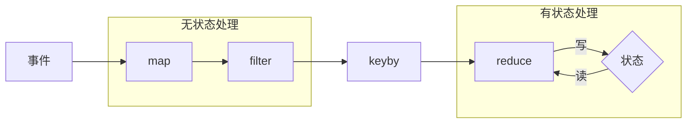

- 事件到达之后立即驱动`MAP`的运行，`MAP`处理完事件之后，将`ETL`后的数据发送给`FILTER`算子，就会立刻驱动`FILTER`算子的运行，依次类推。
- 由于Flink是有状态的流处理，所以可能会有算子会维护和操作内部状态，例如`REDUCE`算子。而`MAP`和`FILTER`是无状态的计算。
- 传统批处理示意图如下：

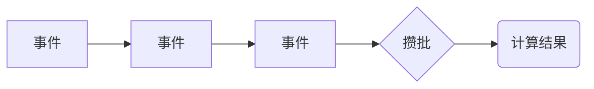

> - 什么是无状态的算子或者函数
>
> 当算子或者函数的输入相同时，输出一定相同
>
> ```c
> int add(int n) {
>     return n + 1;
> }
> 
> map(r => r + 1);
> filter(r => r > 0);
> ```
>
> - 什么是有状态的算子或者函数
>
> 输入相同的情况下，输出不一定相同
>
> ```c
> int count = 0;
> int add(int n) {
>     count += n;
>     return count;
> }
> 
> reduce
> ```

- redis
- nginx
- java nio/netty
- epoll(event poll)

<div style="page-break-after: always; break-after: page;"></div>

## 基于流的世界观

- 在 Flink 的世界观中，一切都是由流组成的，离线数据是有界的流；实时数据是一个没有界限的流：这就是所谓的有界流和无界流。

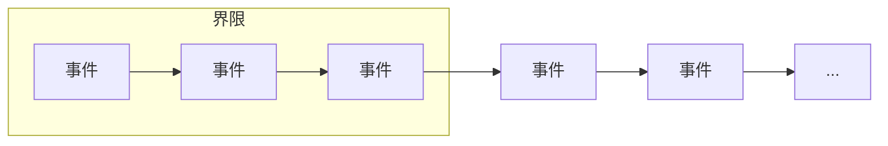


- 在 Spark Streaming 的世界观中，一切都是由批组成的，离线数据是一批数据；实时数据是无数个微小批次组成的数据。


- 流的世界观最终要的一点其实是在静态的离线数据上面加了一个**维度：时间**

- 这个观点来自爱因斯坦的狭义相对论，批处理类似牛顿力学（坐标系：`x`，`y`，`z`），流处理类似狭义相对论力学（坐标系：`x`，`y`，`z`，`t`）。

<div style="page-break-after: always; break-after: page;"></div>

## 分层API

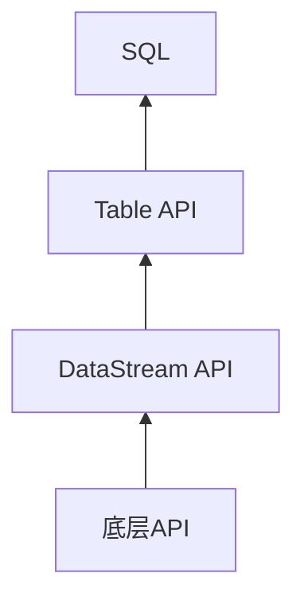

- 我们的学习重点：底层API，DataStream API
- DataStream API对应Spark中RDD的各种算子
- 底层API在Spark中无对应，是学习的**难点**，主要是**处理函数**，用来处理时间语义和状态。

<div style="page-break-after: always; break-after: page;"></div>

## Flink中最重要的三个核心概念

我们在学习Flink时，只需要彻底理解下面三个概念，就能够很好的理解 Flink 的本质：

- 时间语义：事件时间，逻辑时钟（水位线），语义化窗口
- 状态：分清有状态和无状态的区别
- 事件驱动：来一条数据处理一次

<div style="page-break-after: always; break-after: page;"></div>

## 分布式系统重要概念

- 分区：物理分区和逻辑分区的区别是什么
  - hadoop的物理分区：机器节点
  - hadoop的逻辑分区：每个key对应的数据
- 时钟：物理时钟和逻辑时钟的区别是什么
- 并行和并发的区别
  - 异步IO/事件驱动：并发
  - 同步：执行顺序是确定的
  - 异步：执行顺序是不确定的
  - 并行处理的代表：GPU，`(1,1) + (2,2)`

<div style="page-break-after: always; break-after: page;"></div>

## 函数式编程的重要概念

- 不可变数据结构（所以不能编写循环，只能使用递归、尾递归）
- 无状态和有状态
- 惰性求值、懒加载（编写Flink程序只是定义好DAG，然后扔到集群中去，在需要的时候执行）
- 副作用（赋值、异常）
- 函数作为一等公民

<div style="page-break-after: always; break-after: page;"></div>

## Flink vs Spark Streaming

- 流 vs 微批
- 数据模型
  - Spark：RDD，Spark Streaming 的 DStream 实际上也就是一组组小批数据 RDD 的集合。
  - Flink 基本数据模型是数据流，以及事件（Event）序列（Integer、String、Long、POJO Class、Tuple）
- 运行时架构
  - Spark是批计算，将DAG划分为不同的Stage，一个Stage完成后才可以计算下一个Stage。
  - Flink是标准的流执行模式，一个事件在一个节点处理完后可以直接发往下一个节点进行处理。

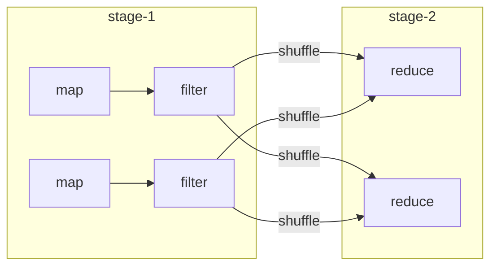


- Spark Streaming的延迟是Flink的1000倍。
- Flink支持事件时间
- Flink支持会话窗口

<div style="page-break-after: always; break-after: page;"></div>

# 单词计数程序

<div style="page-break-after: always; break-after: page;"></div>

## Flink程序典型结构

1. 获取流执行环境
2. 设置并行任务的数量
3. 读取数据源
4. 进行计算
5. 输出
6. 执行程序

<div style="page-break-after: always; break-after: page;"></div>

## 算子的语义

- map的语义：针对流或者列表中的每一个元素，输出一个元素
- flatMap的语义：针对流或者列表中的每个元素，输出0个、1个或者多个元素
- filter的语义：针对流或者列表中的每个元素，输出0个或者1个元素
- reduce的语义：reduce会初始化一个空累加器（类型和流中的元素类型相同），第一条元素到来，直接作为累加器保存，并将累加器输出。第二条以及之后的元素到来，和累加器进行累加操作并更新累加器，然后将累加器输出。reduce函数定义的是输入元素和累加器的累加规则。
- 每个key都会维护自己的累加器，输入数据更新完累加器之后，直接被丢弃

<div style="page-break-after: always; break-after: page;"></div>

## 单词计数程序示意图

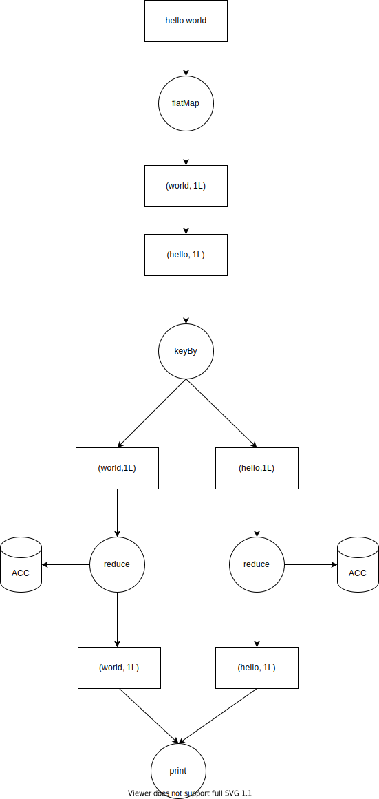

<div style="page-break-after: always; break-after: page;"></div>

# Flink运行架构

<div style="page-break-after: always; break-after: page;"></div>

## 主要内容

- Flink 运行时的组件
- 任务提交流程
- 任务调度原理

## Spark 架构

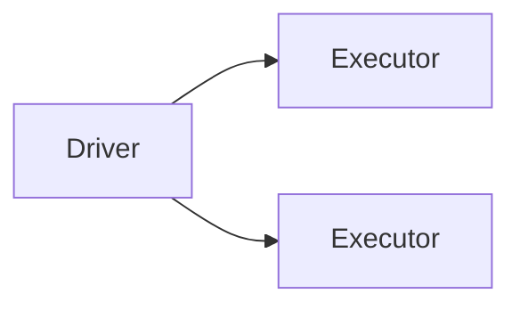


<div style="page-break-after: always; break-after: page;"></div>

## Flink架构

- Flink 运行时由两种类型的进程组成：一个JobManager（作业管理器）和一个或者多个TaskManager（任务管理器）。
- 典型的Master-Slave架构。

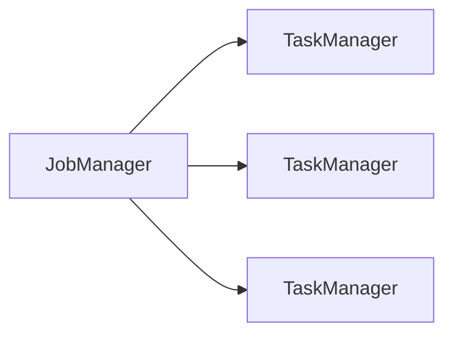

<div style="page-break-after: always; break-after: page;"></div>

## 作业管理器

作业管理器是一个 JVM 进程。进程中包含三类线程：

### 三类线程

- Flink 的资源管理器：资源是**任务插槽**
- 分发器（WebUI）
- JobMaster（每个作业对应一个）

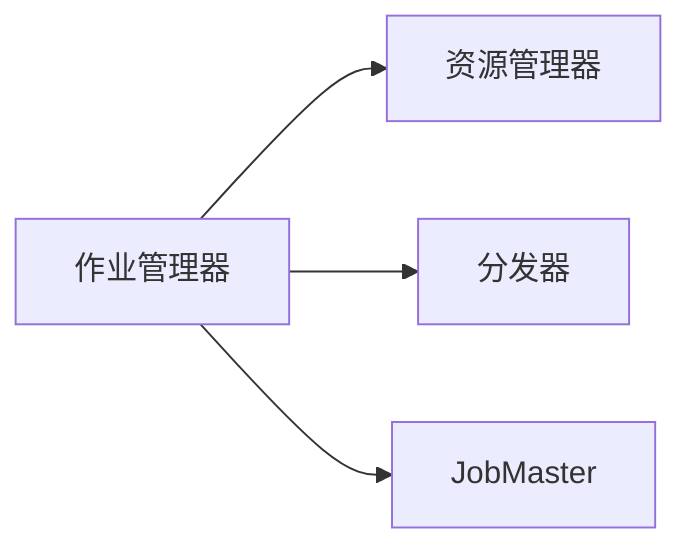


<div style="page-break-after: always; break-after: page;"></div>

## 任务管理器

- 任务插槽（task slot）：是一个物理分区
- 不同的任务插槽就是不同的物理分区
- 每个任务插槽是一个内存分片

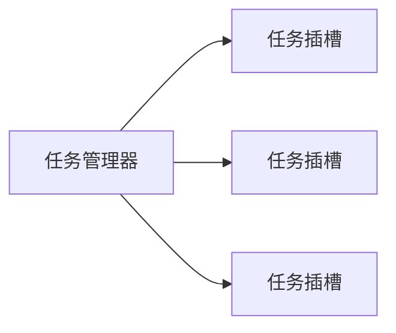


<div style="page-break-after: always; break-after: page;"></div>

## 任务管理器和任务插槽


<div style="page-break-after: always; break-after: page;"></div>

## 任务插槽

- Flink中每一个 TaskManager 都是一个 JVM 进程，每一个任务插槽都会启动一个或者多个线程，它可能会在独立的线程上执行一个或多个 subtask，每一个子任务占用一个任务插槽（Task Slot）。
- 为了控制一个 TaskManager 能接收多少个 Task，TaskManager 通过 Task Slot 来进行控制（一个TaskManager 至少有一个 Slot，`flink-conf.yaml`）。
- 默认情况下，Flink 允许子任务共享 Slot 。这样的结果是，一个 Slot 可以保存作业的整个管道。
- Task Slot是静态的概念，是指 TaskManager 具有的并发执行能力。

<div style="page-break-after: always; break-after: page;"></div>

## 并行度的设置

### 从上到下，优先级升高

1. 任务管理器的配置文件里面：`flink-conf.yaml~ parallelism.default: 1`

2. 在命令行提交任务时指定并行度：`./bin/flink run jar包 -p 16`

3. 全局并行度：`env.setParallism(1)`

4. 针对算子设置并行度：`.print().setParallism(1)`

<div style="page-break-after: always; break-after: page;"></div>

## 并行度设置的最佳实践

1. 不要设置全局并行度
2. 针对某些算子设置并行度，例如数据源，为了不改变数据的顺序
3. 在命令行设置，可以动态扩容

<div style="page-break-after: always; break-after: page;"></div>

## 任务提交流程


<div style="page-break-after: always; break-after: page;"></div>

## 任务提交流程


<div style="page-break-after: always; break-after: page;"></div>

## 不同的DAG结构


<div style="page-break-after: always; break-after: page;"></div>

# DataStream API

<div style="page-break-after: always; break-after: page;"></div>

## 自定义数据源

- SourceFunction: 并行度只能设置为1
- ParallelSourceFunction: 并行自定义数据源
- RichSourceFunction
- RichParallelSourceFunction

<div style="page-break-after: always; break-after: page;"></div>

## 基本转换算子

### 无状态的算子

- map
- filter
- flatMap

<div style="page-break-after: always; break-after: page;"></div>

## 同步和异步

- 同步：事件执行顺序是确定的
- 异步：事件执行顺序是不确定的

<div style="page-break-after: always; break-after: page;"></div>

## 按键分区转换

- keyBy：使用 key 将数据 shuffle 到不同的**逻辑分区**中
- 相同 key 的数据一定在同一个任务插槽（**物理分区**）中
- 不同 key 的数据也可能在同一个任务插槽（**物理分区**）中

```js
HashMap {
    "key-1": key-1的累加器,
    "key-2": key-2的累加器,
    ...
}
```

**逻辑分区**

<div style="page-break-after: always; break-after: page;"></div>

## 按键分区聚合

### 有状态的算子

- sum/max/min/maxBy/minBy
- reduce：
  - 维护空累加器（泛型和输入是一样的），将累加器输出
  - reduce函数定义的是输入元素和累加器的累加规则，累加完以后更新累加器
  - 第一条数据到来直接作为累加器输出
- 只能在 keyBy 之后使用
- 针对每个key都维护自己的累加器，某个key只能访问自己的累加器
- 更新完累加器之后，事件就被丢弃了，**滚动聚合**。

<div style="page-break-after: always; break-after: page;"></div>

## 有状态和无状态的区别

- 相同的输入，一定有相同的输出$\rightarrow$无状态函数

```c
int add(int a, int b) {
  return a + b;
}
```

- 相同的输入，不一定有相同的输出$\rightarrow$有状态函数

```c
int count = 0;
int add(int i) {
  count += i;
  return count;
}
```

<div style="page-break-after: always; break-after: page;"></div>

## 物理分区算子

将数据分发到不同的任务插槽（**物理分区**）

- `shuffle()`
- `rebalance()`
- `rescale()`
- `broadcast()`
- `global()`
- `custom()`

<div style="page-break-after: always; break-after: page;"></div>

## POJO class

1. 必须是公有类
2. 所有字段必须是公有的
3. 必须有空构造器

## 富函数

生命周期（对象的生命周期，html页面的生命周期，锁的生命周期，数据库连接的生命周期，...）

- `open`方法：在算子的计算逻辑执行前执行一次，适合做一些初始化的工作（打开一个文件，打开一个网络连接，打开一个数据库的连接）
- `close`方法：在算子的计算逻辑执行完毕之后执行一次（关闭一个文件，关闭网络连接，关闭数据库连接）

<div style="page-break-after: always; break-after: page;"></div>

# 底层API（处理函数）

处理函数都是富函数

## ProcessFunction

针对没有 keyBy 的数据流，可以使用`ProcessFunction`接口

- `ProcessFunction<I, O>`：`I`是输入的泛型，`O`是输出的泛型
- `processElement`：每来一条数据，调用一次

<div style="page-break-after: always; break-after: page;"></div>

## KeyedProcessFunction

针对 keyBy 之后的键控流（KeyedStream），可以使用`KeyedProcessFunction`

- `KeyedProcessFunction<K, I, O>`：`K`是 key 的泛型，，`I`是输入的泛型，`O`是输出的泛型
- `processElement`
- `onTimer`
- 每个 key 都会维护自己的定时器，每个 key 都只能访问自己的定时器
- 针对每个 key ，在某个时间戳只能注册一个定时器，定时器不能重复注册，如果某个时间戳已经存在定时器，那么再对这个时间戳注册定时器就不起作用了。

<div style="page-break-after: always; break-after: page;"></div>

## 键控状态

每个 key 都会维护自己的状态变量

- ValueState
- ListState
- MapState

## ValueState（值状态变量）

1. 每个 key 都只能访问自己的状态变量，状态变量是每个 key 独有的。**键控状态**
2. 状态变量是**单例**，只能被初始化一次。
3. 状态变量会每隔一段时间作为检查点保存到状态后端（例如HDFS）。
4. 当 Flink 程序启动时，会先去状态后端（例如HDFS）寻找状态变量，如果找不到，则初始化。如果找到了，则直接读取。
5. `.getState`方法通过状态描述符去状态后端寻找状态变量
6. 读取值状态变量中的值：`.value()`方法
7. 将值写入状态变量：`.update()`方法
8. 如何清空状态变量：`.clear()`方法

<div style="page-break-after: always; break-after: page;"></div>

## ProcessWindowFunction

`.keyBy().window()`之后的流

- `ProcessWindowFunction<IN, OUT, KEY, WINDOW>`
- `process`方法：窗口闭合的时候调用
- Flink 中的窗口是左闭右开：$[0,10)$
- 窗口从`1970-01-01 00:00:00`开始对齐
- 滚动窗口的计算公式，开了一个10秒钟的滚动窗口，7秒钟到达的事件属于哪个窗口？
- $窗口开始时间 = 时间戳 - 时间戳 \space \% \space 窗口大小$
- 属于某个窗口的第一条数据到达以后才会开窗口
- 窗口内部状态：
  - 属于窗口的所有事件
  - 定时器：时间戳是窗口结束时间 - 1毫秒（因为是左闭右开区间），方法是`process`函数

<div style="page-break-after: always; break-after: page;"></div>

## AggregateFunction

增量聚合函数，关键思想是在每个窗口中维护一个**累加器**。

- `AggregateFunction<IN, ACC, OUT>`
- `createAccumulator`：创建空累加器，返回值的泛型是累加器的泛型
- `add`：定义输入数据和累加器的聚合规则，返回值是聚合后的累加器
- `getResult`：窗口闭合时发出聚合结果，返回值是将要发送的聚合结果

<div style="page-break-after: always; break-after: page;"></div>

## 增量聚合函数和全窗口聚合函数结合使用

当窗口闭合时：

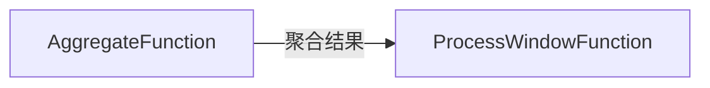

全窗口聚合函数中的迭代器中只有一个元素

<div style="page-break-after: always; break-after: page;"></div>

## ProcessAllWindowFunction

直接对流进行开窗口，等价于将所有数据`keyBy`到同一条流，然后进行开窗口

```java
stream.keyBy(r -> 1).window().process(new ProcessWindowFunction())
```


# 窗口API

<div style="page-break-after: always; break-after: page;"></div>

## 窗口（Window）

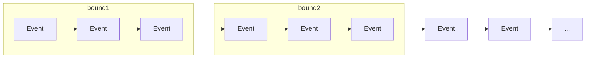

- 一般真实的流都是无界的，怎样处理无界的数据？
- 可以把无限的数据流进行切分，得到有限的数据集进行处理——也就是得到有界流
- 窗口（Window）就是将无限流切割为有限流的一种方式，它会将流数据分发到有限大小的桶（bucket）中进行分析

<div style="page-break-after: always; break-after: page;"></div>

## 窗口类型

- 时间窗口（Time Window）
  - 滚动时间窗口
  - 滑动时间窗口
  - 会话窗口
- 计数窗口（Count Window）
  - 滚动计数窗口
  - 滑动计数窗口

<div style="page-break-after: always; break-after: page;"></div>

## 窗口本质

我们一般在`.keyBy`之后使用`.window`方法来进行开窗，实际上是在`keyBy`之后的逻辑分区中，再按照窗口进行一次逻辑分区。先分流再开窗。

```sql
SELECT * FROM table GROUP BY key, window;
```

Flink窗口是**左闭右开**的区间，例如[0, 5)的窗口最后一个时间戳是4999毫秒

<div style="page-break-after: always; break-after: page;"></div>

## 滚动窗口（Tumbling Window）


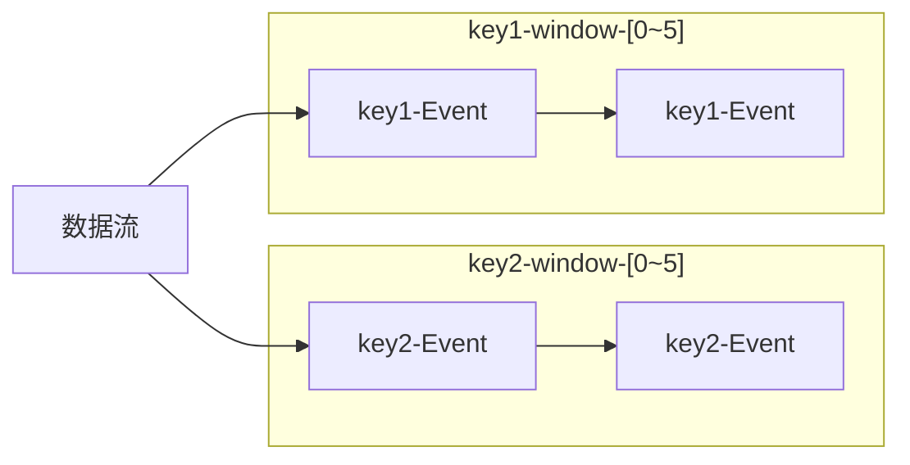

- 将数据依据固定的窗口长度对数据进行切分
- 时间对齐，窗口长度固定，没有重叠

<div style="page-break-after: always; break-after: page;"></div>

## 滑动窗口（Sliding Window）


- 滑动窗口是固定窗口的更广义的一种形式，滑动窗口由固定的窗口长度和滑动间隔组成
- 窗口长度固定，可以有重叠

<div style="page-break-after: always; break-after: page;"></div>

## 会话窗口（Session Window）


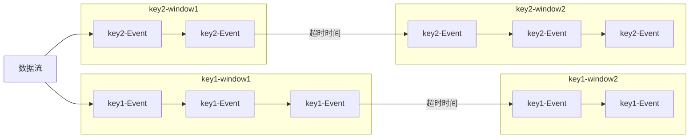

- 由一系列事件组合一个指定时间长度的 timeout 间隙组成，也就是一段时间没有接收到新数据就会生成新的窗口
- 特点：时间无对齐
- 只有Flink支持会话窗口

## 触发器（Trigger）

使用 `KeyedProcessFunction` 可以实现触发器的功能。

Flink 中的事件：

- 数据到来，触发 `processElement`/`map` 的执行。
- 时间到达定时器的时间戳，触发定时器的执行。
- 水位线到达算子，推高算子的水位线。
- 时间到达窗口结束时间，触发 `process` 方法的执行。

事件会进入到事件队列，然后一个一个的执行。例如，定时器会进入到一个优先队列中，然后每隔一段时间检查一下优先队列里面有没有可以执行的定时器。如果有可以执行的定时器，那么出队列执行。

需求：滚动窗口的长度是 10 秒钟，每隔 10 秒钟统计一次 pv 数据。在第一条数据后面的每个整数秒都输出一次窗口中的 pv 数据。在窗口的第一个数据到达时，在数据的时间戳的下一个整数秒输出窗口中的 pv 数据。

例如：时间戳是 1234 毫秒的事件到达，下一个整数秒是多少？

时间戳是 ts ，ts 的下一个整数秒是多少？

$ts后面的整数秒 = ts + 1000 - ts \% 1000$

$1234后面的整数秒 = 1234 + 1000 - 1234 \% 1000 = 2000$

<div style="page-break-after: always; break-after: page;"></div>

# 水位线

由于事件时间的世界里面没有时钟，所以我们需要为这个世界提供时钟，叫做水位线（逻辑时钟）。

在Flink里面，时钟的作用是什么？

- 触发定时器
- 关闭窗口

<div style="page-break-after: always; break-after: page;"></div>

## 逻辑时钟

由于事件时间的世界里面，没有时钟。所以我们要为它提供时钟机制，叫做逻辑时钟（水位线）。

分布式一致性算法

Paxos $\rightarrow$ Raft $\rightarrow$ ZAB

Chubby $\rightarrow$ Zookeeper

<div style="page-break-after: always; break-after: page;"></div>

## ListState

- 列表状态变量，使用方法类似`ArrayList`
- `.get()`返回包含列表中所有数据的迭代器
- `.add()`向列表状态变量中添加元素
- `.clear()`清空列表状态变量

<div style="page-break-after: always; break-after: page;"></div>

## MapState

- 字典状态变量，使用方法类似于`HashMap<K, V>`
- 字典状态变量有两个泛型，`KEY`的泛型和`VALUE`的泛型
- `.put()`更新字典状态变量
- `.remove(KEY)`删除`KEY`以及对应的`VALUE`键值对

<div style="page-break-after: always; break-after: page;"></div>

## API总结

### 单流转换

- map/filter/flatMap
- `ProcessFunction`

### 键控流

- keyBy
- reduce
- `KeyedProcessFunction`

### 单流开窗

- `.windowAll()`
- `ProcessAllWindowFunction`

### 键控流开窗

- `.keyBy().window()`
- `.reduce()`
- `ProcessWindowFunction/AggregateFunction`

### 键控状态

- ValueState
- ListState
- MapState

### 多流合并

- union
  - 以 FIFO 方式合并多条流
  - 流中元素类型必须一样
- connect
  - 以 FIFO 方式合并两条流
  - 两条流的元素类型可以不同
  - `CoMap/CoFlatMap`
  - `CoProcessFunction`

- connect应用场景
  - 一条流进行`keyBy`，另一条流`broadcast`
  - 两条流都进行`keyBy`，将来自两条流的相同 key 的数据合并在一起处理

## 如何处理迟到数据

### 什么是迟到数据？

到达的数据的时间戳小于当前水位线，就是迟到数据。只有在使用事件时间的情况下，才会存在迟到元素。

处理迟到数据的策略：

1. 默认策略：直接丢弃掉迟到数据。当数据到达以后，发现所属窗口已经闭合计算并销毁了，那么数据就被直接丢弃了。
2. 将迟到数据发送到侧输出流中去。侧输出流是不同于主流输出的旁路输出流，可以向侧输出流发送任意数据。
3. 使用迟到元素更新窗口计算结果。也就是当水位线到达窗口结束时间的时候，触发窗口计算，但不销毁窗口，而是选择再等待迟到元素一段时间。
   - `.allowedLateness(Time.seconds(5))`：窗口会等待5秒钟的迟到事件
   - 窗口真正销毁：水位线 $>=$ 窗口结束时间 $+$ allowedLateness
   - 窗口的第一次触发计算：水位线 $>=$ 窗口结束时间，触发计算完以后窗口不会被销毁

处理迟到数据的作用：

- 将迟到数据保存下来，然后统计一下每天有多少迟到数据，然后方便我们调整最大延迟时间的设置，改进计算结果的正确性。

## Linux内核多路复用IO

- `select`：将事件保存在链表中，查询时间复杂度是：$O(N)$
- `poll`
- `epoll`：event poll，将事件保存在红黑树中，查询时间复杂度是：$O(log_2N)$

- `epoll`：Java的NIO、Netty，Scala的Akka，Redis，Nginx，Nodejs，Go
- Nginx将定时事件保存在红黑树中，Flink将定时事件保存在优先队列中

## 树形结构

### 二叉树

- 二叉查找树
- 平衡二叉查找树：AVl，红黑树

### 多叉树

- 2-3-4树
- B树，B+树

## 竞争条件

```java
int i = 0;

Thread1:
	for (int j = 0; j < 100; j++) i++;

Thread2:
	for (int j = 0; j < 100; j++) i++;

i等于多少？200

因为i++不是原子操作

lock
1. register = i; // 将 i 从内存中加载到寄存器（CPU上）
2. register = register + 1; // 寄存器的数值加一
3. i = register; // 将 i 从寄存器写回内存
unlock
    
++++++++++++++
| thread1:i++|
++++++++++++++
| thread2:i++|
++++++++++++++
|  ....      |
++++++++++++++
    
队列中有200个++操作
```

## Flink的数据结构

```
** 任务插槽（物理分区，内存分片）

+--------------------------------------------------------------+
| {                                                            |
|    "key-1": ArrayList,                                       |
|    "key-2": ArrayList,                                       |
|    "key-3": ArrayList,                                       |
| }                                                            |
|                                                              |
| {                                                            |
|    "key-1": {                                                |
|      "window-starttime": ArrayList                           |
|      ....                                                    |
|    },                                                        |
|    "key-2" {                                                 |
|      "window-starttime": ArrayList                           |
|    }                                                         |
| }                                                            |
+--------------------------------------------------------------+
```

## Ajax

```js
ajax(url, callback);
ajax(url, callback);

ajax(url, callback() {
  ajax(url, callback)     
})
```

# Flink中的状态管理

## 状态变量的分类

- 算子状态
- 键控状态

从作用域的角度看状态变量的分类：

- 算子状态：作用域是任务槽，同一个任务槽的所有子任务都可以访问算子状态。算子状态是物理分区可见。一个任务槽无法访问另一个任务槽的算子状态。
- 键控状态：作用域是逻辑分区，也就是当前 key 可见。按照 key 隔离开。不同 key 的支流无法访问其他支流的键控状态。
- 窗口状态变量：`Trigger` 中的 `.getPartitionState()`，还有 `process()` 方法中的 `ctx.windowState().getState()` 。作用域是当前窗口。相同 key 的不同窗口无法访问对方的窗口状态变量。

作用域从上到下越来越小。

## Flink中的状态

- 由一个任务维护，并且用来计算某个结果的所有数据，都属于这个任务的状态。（状态变量，累加器，定时器，窗口中的元素）
- 可以认为状态就是一个本地变量，可以被任务的业务逻辑访问。
- Flink会进行状态管理，包括状态一致性、故障处理以及高效存储和访问，以便开发人员可以专注于应用程序的逻辑
- 在Flink中，状态始终与特定算子相关联
- 为了使运行时的Flink了解算子的状态，算子需要预先注册其状态

**总的说来，有两种类型的状态：**

- 算子状态（Operator State）：算子状态的作用范围限定为算子任务。
- 键控状态（Keyed State）：根据输入数据流中定义的键（key）来维护和访问。

## 算子状态

- 算子状态的作用范围限定为算子任务，由同一并行任务所处理的所有数据都可以访问到相同的状态。
- 状态对于同一任务而言是共享的。
- 算子状态不能由相同或不同算子的另一个任务访问。

**CheckpointedFunction**

```java
void snapshotState(FunctionSnapshotContext context) throws Exception;

void initializeState(FunctionInitializationContext context) throws Exception;
```

## 键控状态

- 键控状态是根据输入数据流中定义的键（key）来维护和访问的。
- Flink为每个key维护一个状态实例，并将具有相同键的所有数据，都分区到同一个算子任务中，这个任务会维护和处理这个key对应的状态。
- 当任务处理一条数据时，它会自动将状态的访问范围限定为当前数据的key。
- 状态变量是单例，使用状态变量描述符中的字符串来保证状态变量的单例特性。`ValueStateDescriptor<>("value-state", Types.LONG)`。

## 键控状态数据结构

- ValueState（值状态）：将状态表示为单个的值
  - `.get()`
  - `.update()`
  - `.clear()`
- ListState（列表状态）：将状态表示为一组数据的列表
  - `.get()`
  - `.add()`
  - `.clear()`
- MapState（字典状态）：将状态表示为一组Key-Value对
  - `.get(key)`
  - `.remove(key)`
  - `.put(key, value)`
  - `.clear()`

## 状态后端

- 每传入一条数据，有状态的算子任务都会读取和更新状态
- 由于有效的状态访问对于处理数据的低延迟至关重要，因此每个并行任务都会在本地维护其状态，以确保快速的状态访问
- 状态的存储、访问以及维护，由一个可插入的组件决定，这个组件就叫做状态后端（state backend）
- 状态后端主要负责两件事：本地的状态管理，以及将检查点（checkpoint）状态写入远程存储（HDFS、RocksDB、文件系统之类的）

## 选择一个状态后端

- MemoryStateBackend（默认）
  - 内存级的状态后端，会将键控状态作为内存中的对象进行管理，将它们存储在TaskManager的JVM堆上，而将checkpoint存储在JobManager的内存中
  - 特点：快速、低延迟，但不稳定
- FsStateBackend
  - 将checkpoint存到远程的持久化文件系统（FileSystem）上，而对于本地状态，跟MemoryStateBackend一样，也会存在TaskManager的JVM堆上
  - 同时拥有内存级的本地访问速度，和更好的容错保证
- RocksDBStateBackend
  - 将所有状态序列化后，存入本地的RocksDB中存储。
  - RocksDB是一个硬盘KV数据库。

# Flink的容错机制

## 一致性检查点（Checkpoints）

- Flink 故障恢复机制的核心，就是应用状态的一致性检查点
- 有状态流应用的一致检查点，其实就是所有任务的状态，在某个时间点的一份拷贝（一份快照）。
- 上游是一个可重置读取位置的持久化设备（Apache Kafka，txt文件）

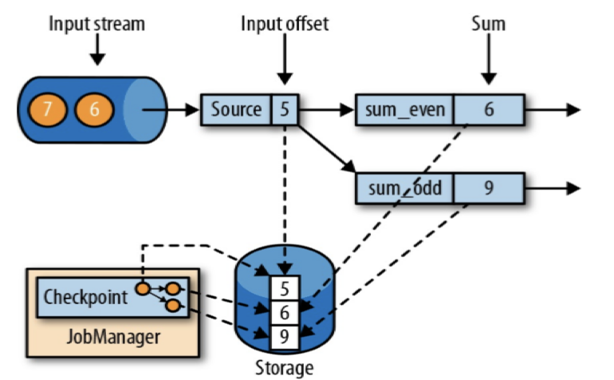

## 从检查点恢复状态

### Flink程序发生故障

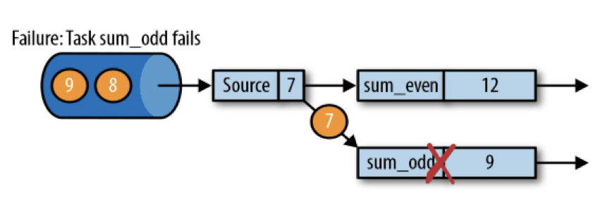

### 重启程序

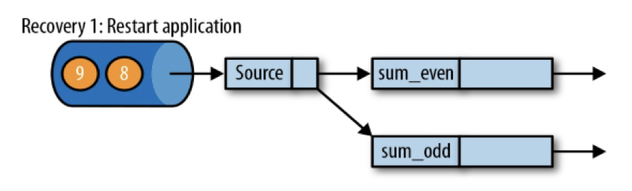

### 从检查点中读取状态

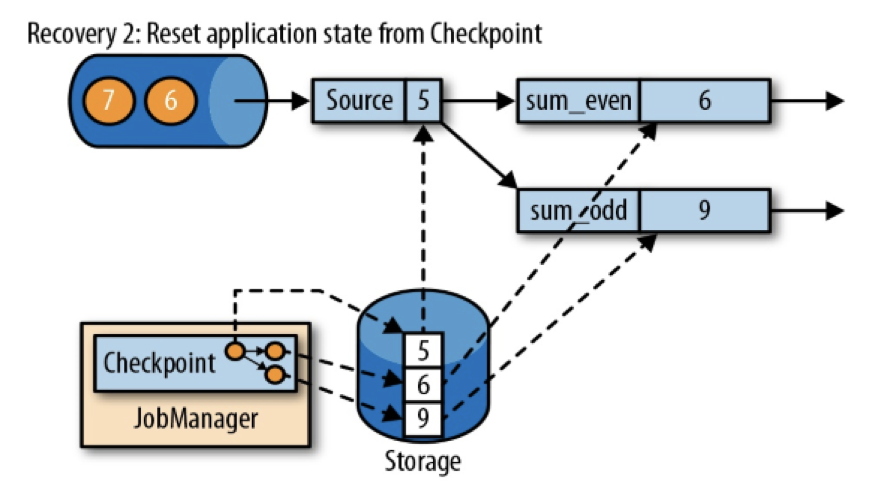

### 重新消费

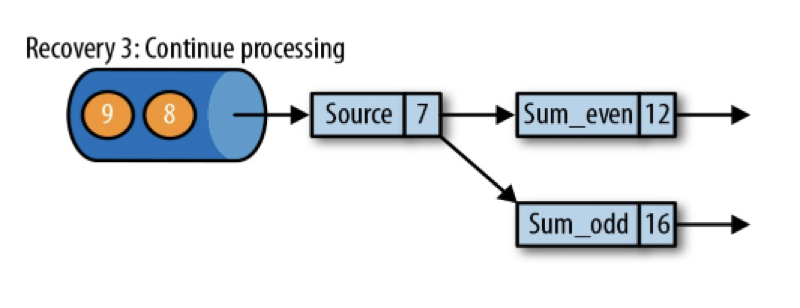

# 检查点的实现算法

# 状态转移矩阵

|         | INITIAL | $S_1$   | $S_2$   | FAIL  | SUCCESS |
| ------- | ------- | ------- | ------- | ----- | ------- |
| fail    | $S_1$   | $S_2$   | FAIL    |       |         |
| success | SUCCESS | SUCCESS | SUCCESS |       |         |
| reset   |         |         |         | $S_2$ | INITIAL |


```
count = 0;

Thread1:
	for (int i = 0; i < 100; i++) count++;
	
Thread1:
	for (int i = 0; i < 100; i++) count++;
	
count等于多少？

Thread1 count++在底层执行的指令：
1. 将count从内存中加载到1号寄存器
2. 1号寄存器中的值加1
3. 将1号寄存器中的值写回内存中的count变量

Thread2 count++在底层执行的指令：
1. 将count从内存中加载到2号寄存器
2. 2号寄存器中的值加1
3. 将2号寄存器中的值写回内存中的count变量

写入mysql表的步骤：
1. 将表从硬盘读入内存
2. 更新内存
3. 写回硬盘

Thread1:
	for (int i = 0; i < 100; i++) push(count加一操作);
	
Thread1:
	for (int i = 0; i < 100; i++) push(count加一操作);
```

```js
{
    5s: 5~10的pv次数,
    10s: 10~15的pv次数
}

0 ~ 10
5 ~ 15

7
```

